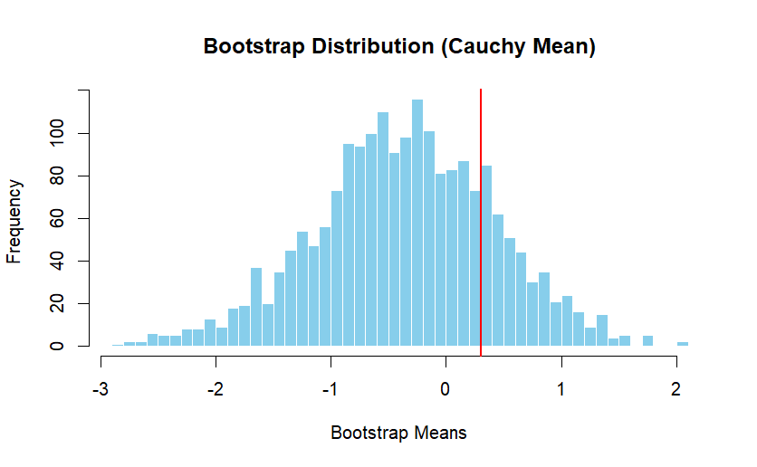
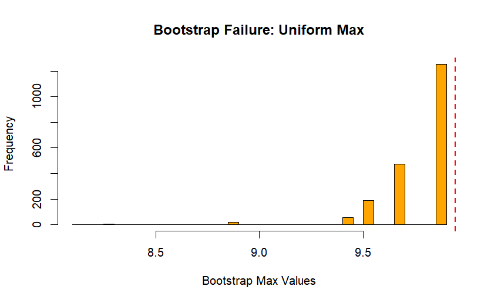

## Phân phối Cauchy không có kỳ vọng (mean) và phương sai hữu hạn. Điều này vi phạm Định lý Giới hạn Trung tâm, làm cho trung bình mẫu Bootstrap biến động cực kỳ mạnh và không hội tụ về phân phối chuẩn.

## Khi ước lượng $\theta$ bằng giá trị lớn nhất ($max$), Bootstrap bị chặn bởi giá trị lớn nhất của mẫu gốc. Nó không thể tạo ra giá trị nào lớn hơn số đã quan sát được, dẫn đến phân phối bị rời rạc và sai lệch (bias).
