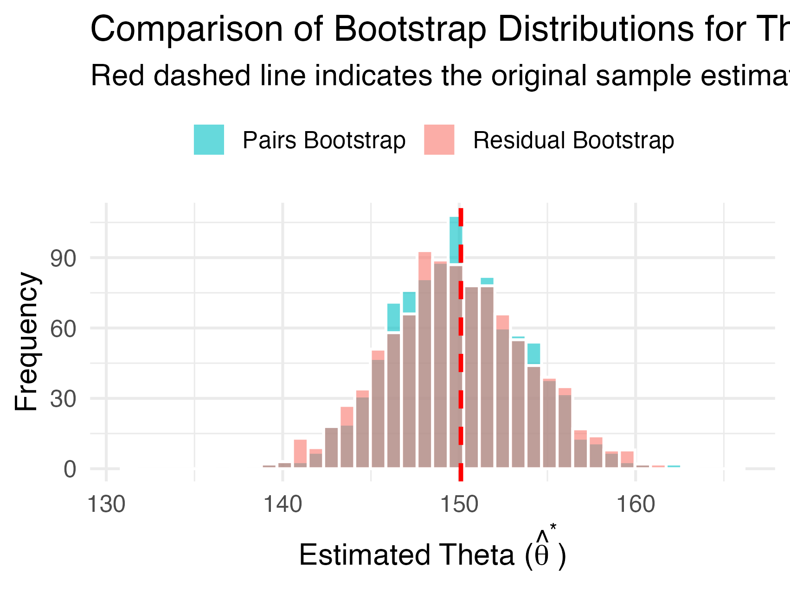

### Nhận xét sự khác biệt giữa hai phương pháp Bootstrap (Câu b)

Dựa trên biểu đồ Histogram so sánh phân phối thực nghiệm (**empirical distribution**) của ước lượng $\hat{\theta}^*$ sinh ra từ hai phương pháp: Bootstrap dữ liệu (Pairs Bootstrap) và Bootstrap thặng dư (Residual Bootstrap), ta có thể rút ra những đánh giá chuyên sâu sau:

**1. Xu hướng hội tụ (Central Tendency):**
Cả hai phân phối đều có xu hướng hội tụ mạnh mẽ và phân bố đối xứng xung quanh giá trị ước lượng gốc $\hat{\theta}$ (đường đứt nét màu đỏ, $\approx 150$). Điều này minh chứng cho tính **unbiasedness** (không chệch) của cả hai phương pháp lấy mẫu lại (resampling methods) đối với tham số $\theta$.

**2. Hình dáng phân phối và Độ phân tán (Distribution Shape & Dispersion):**
* **Pairs Bootstrap (Màu xanh dương - Non-parametric):** Phân phối trải đều và có phần bám sát vào đặc tính nguyên thủy của bộ dữ liệu. Vì phương pháp này xáo trộn trực tiếp các cặp $(R_i, S_i)$ mà không dựa trên bất kỳ giả định nào của mô hình, nó giữ lại toàn bộ cấu trúc nội tại (bao gồm cả các điểm outliers nếu có).
* **Residual Bootstrap (Màu đỏ nhạt - Semi-parametric):** Phân phối của phương pháp này tỏ ra "mượt" (smooth) và tập trung (concentrated) hơn ở vùng trung tâm. Nguyên nhân là do dữ liệu mô phỏng $\hat{R}_i^*$ được sinh ra dựa trên phương trình hồi quy tuyến tính đã được làm trơn $1/R_i = \hat{\beta}_0 + \hat{\beta}_1/S_i$.

**3. Sự tương đồng đáng kể (Remarkable Congruence):**
Sự khác biệt giữa hai phân phối là rất nhỏ (vùng màu nâu giao thoa chiếm diện tích chủ đạo). Sự **consistency** (tính nhất quán) này là minh chứng mạnh mẽ cho thấy:
* Giả định hồi quy tuyến tính (Linearity assumption) của mô hình Beverton-Holt nghịch đảo là phù hợp với dữ liệu thực tế.
* Sai số (residuals) của mô hình có khả năng cao đạt được tính **homoscedasticity** (phương sai đồng nhất), khiến cho việc xáo trộn phần dư (Residual Bootstrap) mang lại kết quả gần như tương đương với việc xáo trộn dữ liệu thô (Pairs Bootstrap).

**Kết luận:** Cả hai phương pháp đều cung cấp sai số chuẩn (Standard Error) đáng tin cậy. Tuy nhiên, trong bối cảnh mô hình tuyến tính hóa tỏ ra phù hợp (goodness-of-fit cao), Residual Bootstrap thể hiện tính **robustness** (mạnh mẽ) cao hơn một chút trong việc kiểm soát phương sai của ước lượng $\hat{\theta}^*$.